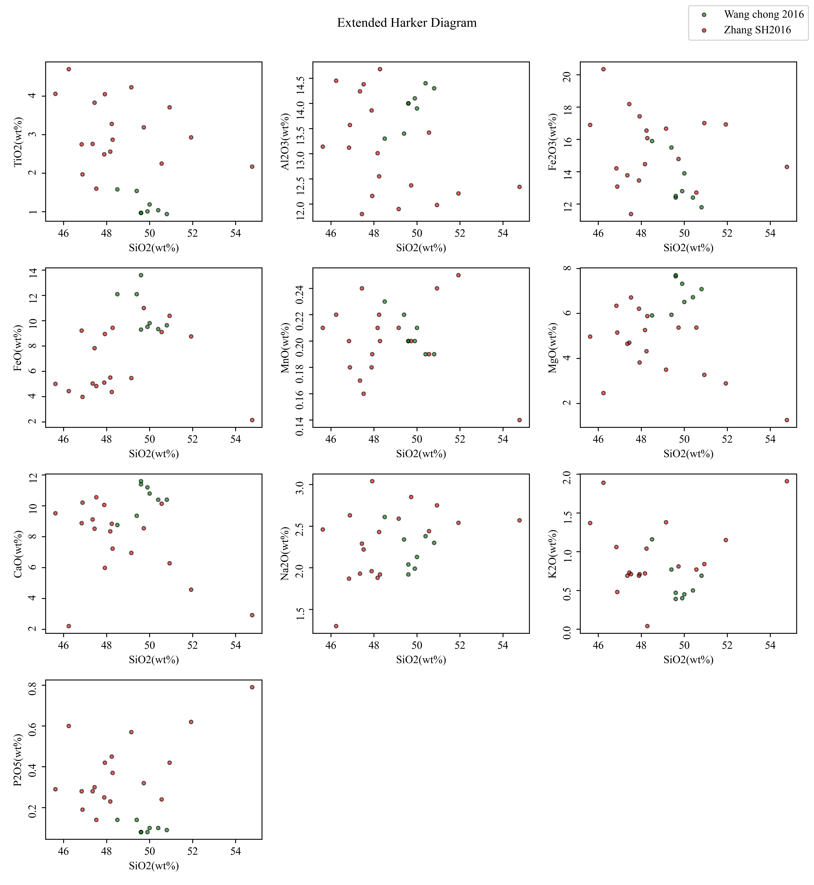

# Harker-PF 基于自动语义变换实现的自动铁校正功能的地球化学主量元素协变图解软件

版本号：1.0.0

## 1 介绍

Harker-PF 是Harker Diagram extended with Part Flexibility 的缩写，用于解决地球科学场景中协变图解的自动铁校正问题。这一软件基于 Python 构建，**能够运行于几乎所有主流操作系统**, 比如 Windows 10、11 和 GNU Linux, 等等。此外，**Harker-PF 不依赖任何额外的商业软件**, 比如 MS Excel 或者 CorelDraw, 直接从数据生成矢量图格式。

Harker图解是一种经典的地球化学主元素分布图，主要用于展示地球化学主元素的分布情况，特别是以SiO2为横坐标的主量元素分布及其趋势。常见的参与元素氧化物包括TiO2(wt%)、Al2O3(wt%)、Fe2O3(wt%)、FeO(wt%)、MnO(wt%)、MgO(wt%)、CaO(wt%)、Na2O(wt%)、K2O(wt%)、P2O5(wt%)等。铁元素在地球化学元素数据中占据了重要的地位，其含量不仅反映了整体岩石矿物的铁镁质含量，其化合价态组合还揭示了岩石生成过程中的氧逸度和氧化还原反应过程等信息。然而，由于地球化学成分数据测试过程的复杂性和样品来源的多样性，铁元素的氧化物在原始数据中呈现出多样性。有些数据使用Fe2O3(wt%)和FeO(wt%)分别计算，而有些则将Fe2O3(wt%)和FeO(wt%)折算成FeO_Total(wt%)或Fe2O3_Total(wt%)。目前学术界普遍的做法是将所有铁元素折算成FeO_Total(wt%)进行可视化展示。然而，传统的Harker图解并没有明确指定铁元素氧化物的具体使用方法，而在实际研究中，缺乏一种简洁可靠的图形界面工具软件来实现铁元素氧化物的自动校正，这导致在进行数据比对时必须面对这种数据不一致的问题。为了解决这一问题，我们开发了Harker-PF软件，这是一种基于自动语义变换实现自动铁校正功能的地球化学主元素协变图解软件。在开发过程中，我们选择了PySide6开发框架来构建简洁的图形化软件界面，使用Pandas进行原始数据文件的打开和导入，借助ChemPy获取和查询化学式摩尔数值等参数，并在软件代码中加入了自动语义变换识别思想的设计。软件能够从原始数据中识别出已存在的铁元素成分数据，并根据用户在图形界面上选择的铁元素呈现方案，使用Matplotlib这一经典的可视化工具将绘图结果进行可视化展示。

## 2. 环境

得益于 PySide6 和其他基础库的跨平台特性，本软件具备出色的兼容性，能够在多种硬件配置和操作系统环境中稳定运行。无论是 Window s还是GNU Linux，用户均可顺畅地部署和使用本软件。
为了满足不同用户的需求，本软件提供了灵活的安装选项和执行方式，确保用户能够根据个人偏好和系统环境，选择最合适的安装和运行方案。
本软件的目标是让每一位用户都能便捷、高效地对所关注的数据进行快速的协变图解，无论所用的具体是哪种设备或操作系统。

### 2.1 开发环境

该软件使用的开发环境如下：

| 项目  | 版本 | 用途 |
|-------|-------|-------|
| Python    | 3.12  | 解释器，提供运行时支持 |
| PySide6 | 6.6.2 | GUI 库，提供图形界面支持 |
| beeware | 0.3.0 | 项目框架，提供运行时框架 |
| matplotlib | 3.8.3 | 绘图库，提供绘图支持 |
| numpy | 1.26.4 | 数值计算库，提供数值计算支持 |
| pandas | 2.2.1 | 表格处理库，提供表格处理和 CSV 文件导出支持 |
| scipy | 1.12.0 | 用于科学和技术计算的库 |
| toga | 0.4.2 | Python 原生，OS 原生 GUI 工具包 |
| toga-chart | 0.2.0 | 为 Toga 提供图表部件 |
| openpyxl | 3.1.2 | 用于读取/写入 Excel 2010 xlsx/xlsm/xltx/xltm 文件的库 |
| scikit-learn | 1.4.1.post1 | Python 中的机器学习库 |

### 2.2 硬件要求

运行该软件所需的硬件设备如下：

| 硬件项目 | 最低配置要求 |
|----------|--------------|
| 处理器     | Intel X86_64、AMD64 64位处理器或 ARM64 64位处理器，双核，频率高于1GHz |
| 内存       | 高于4GB       |
| 本地磁盘空间 | 高于1GB       |

### 2.3 系统要求

运行该软件所需的操作系统环境如下：

| 操作系统   | 最低版本 | 架构 |
|------------------|------------------------------|--------------|
| Windows 10       | 1809                         | 64-bit       |
| Ubuntu           | 22.04.3                      | 64-bit       |

## 3. 安装和运行

Harker-PF 软件提供了多种安装方式。

### 3.2 源码安装

源码安装适合各种操作系统用户，尤其推荐给 GNU/Linux、BSD、macOS 用户。

这一安装路径要求用户在本地操作系统上事先已经安装 Python 3.10 或 更高版本，并安装好必要的依赖包。

首先，打开终端，从 GitHub 上克隆项目仓库：

```Bash
git clone https://github.com/Harker-PF/Harker-PF.git
```

然后，进入到代码目录下，安装必要的依赖包：
```Bash
cd Harker-PF
pip install -r requirements.txt
```

完成了依赖包的安装之后，就可以进入次级目录，使用下列命令来运行软件：
```Bash
cd harkerpf
briefcase dev
```

### 3.2 以MSI格式安装到操作系统

使用MSI文件将Harker-PF安装到操作系统中，适合Windows系统用户。

针对Windows系统用户，Harker-PF 提供了MSI格式的安装包文件：

下载地址在： 

[https://pan.baidu.com/s/1xigfbSffe7fYWfeghV4zIw?pwd=8qz1](https://pan.baidu.com/s/1xigfbSffe7fYWfeghV4zIw?pwd=8qz1)

提取码：8qz1 

下载MSI文件后，双击文件开始安装。


有两种安装模式可供选择，通常情况下使用第一种模式即可。


安装过程大约需要5分钟。


安装完成后，点击完成按钮。


然后你可以在开始菜单中找到XY-SP图标并运行它。


如果需要卸载，则可以在控制面板或者系统设置中进行。


### 3.3 解压缩ZIP文件直接运行

这种方法不需要安装，解压缩之后双击Harker-PF.exe文件即可运行。

可以从[下载链接](https://pan.baidu.com/s/1xigfbSffe7fYWfeghV4zIw?pwd=8qz1) 提取码 `8qz1` 下载 ZIP 文件。

解压ZIP文件，你将得到一个Harker-PF文件夹。

然后在这个文件夹中找到Harker-PF.exe文件并双击运行，就可以了。

但需要注意，不要将解压缩的文件夹放到非英文目录下，也不要修改或者删除文件夹中的任何内容。


### 3.4 运行





## 4 数据模板

最新的数据模板都在 [DataFileSamples 这个目录里面可以下载](https://github.com/GeoPyTool/GeoPyTool/tree/master/DataFileSamples)。

Settings.xlsx 是展示各种设置项目的效果。 **Geochemistry.xlsx**则是地球化学成分数据所对应的数据模板。

请一定遵守数据模板的格式，把你的数据复制粘贴进去，填写好设置信息。


